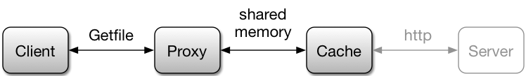

# IPC: Inter-Process Communication

## Foreword

This project has two parts, plus a graded report that offers an additional opportunity for extra-credit.  In the first part,
you will convert an implementation of a getfile server into a getfile proxy
that converts incoming Getfile requests into http requests for a server on the
internet.

In the second part, you will implement a simple cache that
communicates with the proxy via shared memory.

## Setup

You can clone the code in this repository with the command:

```
git clone https://github.gatech.edu/gios-spr-19/pr3.git

```

Note: _if_ you choose to **fork** the repository (you are not required to do so,) 
**please remove the class access to it**.  You can do this by going to the "Settings" 
(on github.gatech.edu) for your repository.  On the left there is a tab for 
"Collaborators and Teams".  When you choose this it will show the class team
membership.  Simply remove it (there is an "x" on the right hand side).   Your
repository is now private and only accessible to you and class instructors.


**If you do not remove team access, your code is visible to everyone in class.  This
is the same as sharing your code (because you _are_ sharing your code.)**

## Submission Instructions
**Unless noted otherwise, code must be submitted through the `submit.py` script at the top
level of this repository.**  For instructions on how to submit individual
components of the assignment see the instructions below.  Unless otherwise noted, you are
limited to submitting 10 times within a 24 hour period. Your last submission before the project
deadline will be downloaded by the teaching assistants and graded according to the assignment
rubric.

After submitting, you may double-check the results of your submission by
visiting the [Udacity/GT autograding website](https://bonnie.udacity.com) and
going to the student portal.

## README
Throughout the project, we encourage you to keep notes on what you have done,
how you have approached each part of the project and what resources you used in
preparing your work.  We have provided you with a prototype file,
**readme-student.md** that you should use throughout the project.

You may submit your **readme-student.md** file with the command:

```
python submit.py readme
```

At the prompt, please provide your GT username and password.

If this is your first time submitting, the program will then ask you if you want
to save the jwt.  If you reply yes, it will save a token on your filesystem so that you don't have to provide your
username and password each time that you submit.

The Udacity site will store your **readme-student.md** file in a database.
This will be used during grading.  The submit script will acknowledge receipt
of your README file.

> For this assignment, you may submit your code up to 10 times in a 24 hour period. After the deadline, we download your last submission prior to the deadline, review your submission and assign a grade. There is no limit to the number of times you may
submit your **readme-student.md** file.

## Part 1

To convert the getfile server into a proxy, you only need to replace the part
of the code that retrieves the file from disc with code that retrieves it from
the web.  Using the gfserver library provided in the starter code, this is as
easy as registering a callback.  Documentation can be found in the gfserver.h
file.  To implement the callback you should use the [libcurl's “easy” C interface](http://curl.haxx.se/libcurl/c/).


**The framework code for part 1 is in the `server` directory.**

This code will handle implementation of the boss-worker multi-threading pattern.  This allows
it to serve multiple connections at once. Note that you don’t have to write your own http 
server.  Workloads are provided for files that live on an amazon S3 instance
http://s3.amazonaws.com/content.udacity-data.com.  Concatenate this with one of
the paths found in workload.txt to create a valid url. 
**Note: the grading server will not use the same URL.**
Do not encode this URL into your code or it should fail in the auto-grader.

Here is a summary of the relevant files and their roles.

- **Makefile** - (do not modify) file used to compile the code.  Run `make` to compile your code.

- **gfserver.h** - (do not modify) header file for the library that interacts with the getfile client.

- **gfserver.o** - (do not modify) object file for the library that interacts with the getfile client.

- **handle_with_curl.c** - (modify) implement the handle_with_curl function here using the libcurl library.  On a 404 from the webserver, this function should return a header with a Getfile status of `GF_FILE_NOT_FOUND`.

- **handle_with_file.c** - (not submitted) illustrates how to use the gfserver library with an example.

- **gfclient_download** - a binary executable that serves as a workload generator for the proxy.  It downloads the requested files, using the current directory as a prefix for all paths. Note you must specify the correct port to use.

- **gfclient_measure** - a binary executable that serves as a workload generator for the proxy.  It measures the performance of the proxy, writing one entry in the metrics file for each chunk of data received. Note you must specify the correct port to use.

- **proxy-student.h** - (submitted) you may use this header file to store any content you desire.  If you do not wish to do so,
you can ignore this file.

- **steque.[ch]** - (do not modify) you may find this steque (stack and queue) data useful in implementing the the cache.

- **webproxy.c** - (modify) this is the main file for the webproxy program.  Only small modifications are necessary.

- **workload.txt** - (not submitted) this file contains a list of files that can be requested of  http://s3.amazonaws.com/content.udacity-data.com as part of your tests.

Once you have completed your program, you can submit it __from the top level project directory__ with the command:

```
python submit.py proxy_server
```

## Part 2

The objective of this second part of the project is for you to gain experience
with shared memory-based IPC. You will implement a cache process that will run
on the same machine as the proxy and communicate with it via shared memory.



For transferring local files efficiently, you are expected to separate the data
channel from the command channel. File content is transferred through the data
channel and transfer command is transferred through the command channel. The
data channel is implemented using shared memory and the command channel is
implemented using other IPC mechanisms, such as message queue.

Because the goal is to give you experience with shared memory IPC and not cache
replacement policy or cache implementations, you will access the contents of
the cache through an API (simplecache.h) that abstracts away most details of
the cache implementation.  Your focus will be on relaying the contents of the
cache to the proxy process by way of shared memory.

You can use either System V or the POSIX API to implement the shared-memory
component and/or other IPC mechanisms (e.g., message queues or semaphores).
Please see the list of reference material.  If it works on the course’s VM,
then it will work in the Udacity test.

**The framework code for part 2 is in the `cache` directory.**

_Note that some of this code is shared (as a symbolic link) between the two projects.  Thus, changes
applied to one will be made to the other._  Some environments do not work well with symbolic
links; in that case you may need to copy the contents from one directory to the other.  The symbolic
links **do** work correctly in the class environment.

The command line interface for the proxy should include two new components: the
number of segments and the size of the segments to be used for the interprocess
communication.  Instead of automatically relaying requests to the http server,
the proxy should query the cache to see if the file is available in local
memory already.  If the file is available there, it should send the cached
version.  In the real world, you would then have the proxy query the server to
obtain the file.  For the Udacity quiz submission, however, **you need only
check the cache**. In other words, you only need to implement client, proxy,
cache, and the communication protocols, depicted in dark colors in the figure.

In the interprocess communication, **the proxy is responsible for
creating and destroying the shared memory (or message queues)**.  This is good
practice because in a scenario where the cache is connected to more than one
client (or proxy servers in this case) it makes it easier to ensure that:

- a non-responsive client doesn’t degrade the performance of the cache
- a malicious client doesn’t corrupt another’s data.

From the cache’s perspective this falls under the “don’t mess with my memory”
adage.

The cache must set up some communication mechanism (socket, message
queue, shared memory) by which the proxy can communicate its request along with
the information about the communication mechanism (shared memory name, id,
etc.)  For the purposes of this project, this mechanism does not have to be
robust to misbehaving clients.

Neither the cache daemon nor the proxy should crash if the other process is not
started already.   For instance, if the proxy cannot connect to the IPC
mechanism over which requests are communicated to the cache, then it might
delay for a second and try again.  The test server will start your cache and proxy
in different orders.

It is not polite to terminate a process without cleaning up, so the proxy
process (and perhaps the cache as well depending on your implementation) must
use a signal handler for both SIGTERM (signal for kill) and SIGINT (signal for
Ctrl-C) to first remove all existing IPC objects -- shared memory segments,
semaphores, message queues, or anything else -- and only then terminate.  The
test server will check for cleanup of IPC resources.

Depending on your implementation, it may be necessary to hard-code something
about how the proxy communicates its requests to the cache (e.g. a port number
or a name of shared memory segment).  This is acceptable for the purpose of the
assignment.

Here is a summary of the relevant files and their roles.

- **cached_files** - (not submitted) a directory containing files that will be stored in the cache.  Use in conjunction with locals.txt.

- **gfserver.h** - (do not modify) header file for the library that interacts with the getfile client.

- **gfserver.o** - (do not modify) object file for the library that interacts with the getfile client.

- **handle_with_cache.c** - (modify) implement the handle_with_cache function here.  It should use one of the IPC mechanisms discussed to communicate with the simplecached process to obtain the file contents.  You may also need to add an initialization function that can be called from webproxy.c

- **locals.txt** - (not submitted) a file telling the simplecache where to look for its contents.

- **Makefile** - (do not modify) file used to compile the code.  Run `make` to compile your code.

- **cache-student.h** - (modify) this optional header file may be used by you, and included in any of the submitted files.  Its use
is optional, but it is there in case you would like to use it.

- **shm_channel.[ch]** - (modify) you may use these files to implement whatever protocol for the IPC you decide upon (e.g., use of designated socket-based communication, message queue, or shared memory ).

- **simplecache.[ch]** - (do not modify) these files contain code for a simple, static cache.  Use this interface in your simplecached implementation.  See the simplecache.h file for further documentation.

- **simplecached.c** - (modify) this is the main file for the cache daemon process, which should receive requests from the proxy and serve up the contents of the cache using the simplecache interface. The process should use a boss-worker multithreaded pattern, where individual worker threads are responsible for handling a single request from the proxy.

- **steque.[ch]** - (do not modify) you may find this steque (stack and queue) data useful in implementing the cache.  Beware this uses malloc and may not be suitable for shared memory.

- **gfclient_download** - a binary executable that serves as a workload generator for the proxy.  It downloads the requested files, using the current directory as a prefix for all paths. You must specify the correct port to use.

- **gfclient_measure** - a binary executable that serves as a workload generator for the proxy.  It measures the performance of the proxy, writing one entry in the metrics file for each chunk of data received. You must specify the correct port to use.

- **webproxy.c** - (modify) this is the main file for the webproxy program.  Only small modifications are necessary.  In addition to setting up the callbacks for the gfserver library, you may need to pre-create a pool of shared memory descriptors, a queue of free shared memory descriptors, associated synchronization variables, etc.

- **workload.txt** - (not submitted) this file contains a list of files that can be requested of  https://s3.amazonaws.com/content.udacity-data.com as part of your tests.

Once you have completed your program you can submit it __from the top level project directory__ with the command:

```
python submit.py proxy_cache
```

## References

### Relevant Lecture Material

- P3L3 Inter-Process Communication
    - SysV Shared Memory API
    - POSIX Shared Memory API

### Sample Source Code

- [Signal Handling Code Example](http://www.thegeekstuff.com/2012/03/catch-signals-sample-c-code/)
- [Libcurl Code Example](https://www.hackthissite.org/articles/read/1078)

### Address Sanitizer

Note that address sanitizer is enabled in the test server as well as the
project Makefile.  To fully exploit this, you may need to set further options
for your environment.

- [Google Sanitizer Wiki](https://github.com/google/sanitizers/wiki/AddressSanitizer)
- [Using GDB with Address Sanitizer](https://xstack.exascale-tech.com/wiki/index.php/Debugging_with_AddressSanitizer)

Address Sanitizer is not compatible with valgrind.  If you wish to use valgrind, you
should build a version of your code without Address Sanitizer. In most cases, your
code will be tested with Address Sanitizer enabled.

## Rubric

### Part 1: Sockets (35 points)

#### Proxy Server: Sockets

- Correctly send client requests to server via curl
- Correctly send responses back to client using gfserver library

### Part 2: Shared Memory (55 points)

#### Proxy Server: Shared Memory

- Creation and use of shared memory segments
- Segment ID communication
- Cache request generation
- Cache response processing
- Synchronization
- Proper clean up of shared memory resources

#### Cache: Shared Memory

- Segment ID communication
- Proxy request processing
- Proxy response processing
- Synchronization

### Report (10 points + 5 points Extra Credit)

- The readme-student.md file is where you write your report. Please include
    - Summary of the project design
    - Any observations or insights
    - Any suggestions for future improvement

Based upon your contributions here, you may receive up to five (5) points in extra credit
from your grader.  Examples of activities that can be used for extra credit include:

- Identifying unauthorized third party code repositories.
- Finding and clearly demonstrating cases that pass the auto-grader (Bonnie) but should not
- Examples of ways that you tested your own code that are beyond the tests done by Bonnie
- Proposing better explanations and documentation for the project.

